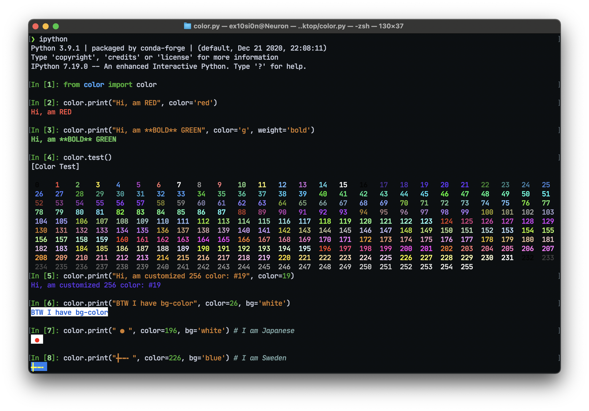

# color.py
A Python package enable rich text in console output

## Demo

## Usage - Methods

### `color.print()`
to print colorful output
params:
- color = int: color.test().code | str: 'r', 'g', 'b', 'y', 'c', 'm'
- weight = str: 'normal', 'bold'
- bg = str: 'r', 'g', 'b', 'y', 'c', 'm', '1', '0'
- end = str: [any string]

### `color.test()`
cheatsheet for color code
params:
- None

