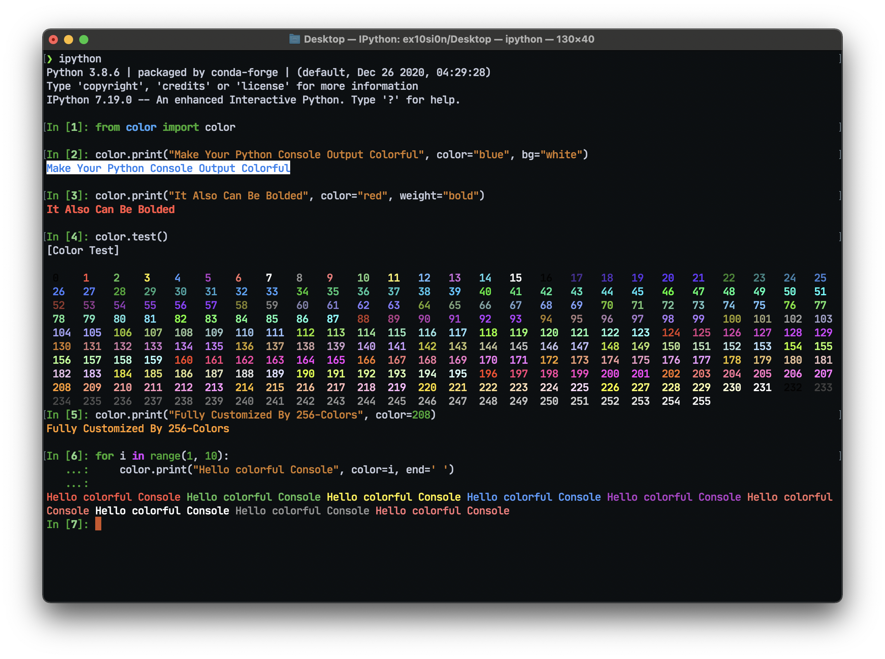

# color.py
A Python package enable rich text in console output

## Installation

```bash
pip install colorfulconsole
```

## Demo

Color printer



String renderer


## Usage - Methods

### `color.print()`
to print colorful output
params:
- color = int: color.test().code | str: 'r', 'g', 'b', 'y', 'c', 'm'
- weight = str: 'normal', 'bold'
- bg = str: 'r', 'g', 'b', 'y', 'c', 'm', '1', '0'
- end = str: [any string]

### `color.test()`
cheatsheet for color code
params:
- None

### `render.render()`

Render a string in a given foreground and background color.
The sample pattern is shown below:

    string =
    +----------------------------------+
    |                                  |
    |                                  |
    +----------------------------------+
    
    fg =
    rgbyrgbyrgbyrgbyrgbyrgbyrgbyrgbyrgby
    g                                  r
    b                                  g
    yrgbyrgbyrgbyrgbyrgbyrgbyrgbyrgbyrgb
    
    bg =
    ++++++++++++++++++++++++++++++++++++
    +cccccccccccccccccccccccccccccccccc+
    +cccccccccccccccccccccccccccccccccc+
    ++++++++++++++++++++++++++++++++++++

Call` render(string, fg, bg)` to render the string in the foreground color.
